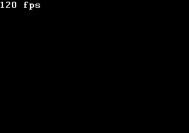

# Street Fighter AI Automation

This project automates gameplay for Street Fighter using a machine learning model trained on game state and action data. The AI learns to predict optimal action sequences based on the current game state and executes them in real time.

## Project Structure

- `PythonAPI/`  
  Contains the main Python scripts for data collection, model inference, and game control:
  - `bot.py`: Main bot logic, including ML model inference and command execution.
  - `controller.py`: Interfaces with the game to read state and send commands.
  - `data_collector.py`: Records game states and actions for training.
  - `dataset_creation.py`: Handles dataset generation and formatting.
  - `model.py`: Loads and applies the trained ML model.
  - `buttons.py`, `command.py`, `game_state.py`, `player.py`: Helper modules for representing game entities and actions.
  - `model_and_vars.pkl`: Serialized trained model and action mappings.

- `training/`  
  Contains data and notebooks for model training:
  - `final.csv`: Combined and cleaned training dataset.
  - `model_training.ipynb`: Jupyter notebook for preprocessing, training, and evaluating the ML model.
  - `model_and_vars.pkl`: Output model file for inference.
  - `train1.csv`, `train2.csv`, `train3.csv`: Source training data.

## Workflow

1. **Data Collection**  
   - Game states and action sequences are recorded during gameplay using [`data_collector.py`](PythonAPI/data_collector.py).
   - Data is saved as CSV files (`train1.csv`, `train2.csv`, `train3.csv`).

2. **Dataset Preparation**  
   - Raw CSVs are combined and cleaned using [`dataset_creation.py`](PythonAPI/dataset_creation.py).
   - The final dataset is saved as `final.csv`.

3. **Model Training**  
   - [`model_training.ipynb`](training/model_training.ipynb) preprocesses data, encodes actions, and trains a RandomForestClassifier.
   - The trained model and action mappings are saved as `model_and_vars.pkl`.

4. **Inference and Automation**  
   - [`bot.py`](PythonAPI/bot.py) loads the trained model and predicts the next action sequence based on the current game state.
   - Predicted actions are executed in-game via the controller interface.

## How to Run

1. **Collect Data**
   - Run the bot and play the game to generate training data.

2. **Prepare Dataset**
   - Use `dataset_creation.py` to combine and clean CSVs.

3. **Train Model**
   - Open `model_training.ipynb` and run all cells to train and export the model.

4. **Automate Gameplay**
   - Run `bot.py` to start the AI bot and automate Street Fighter gameplay.

## Requirements

- Python 3.12+
- scikit-learn
- pandas
- numpy

## Test Run

